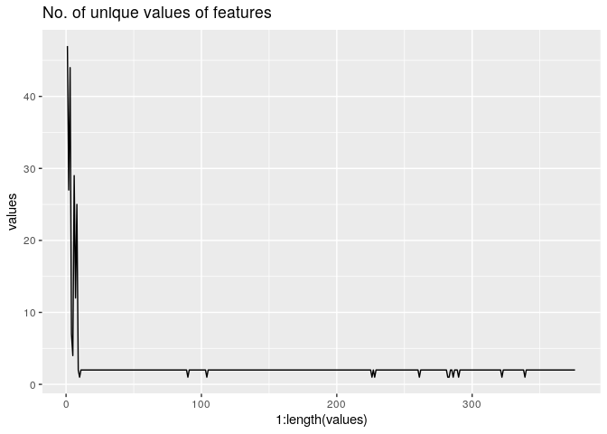
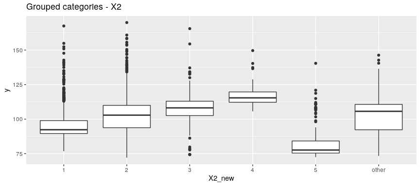
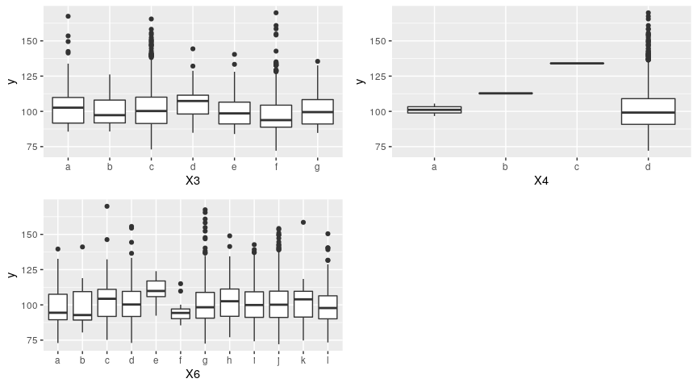
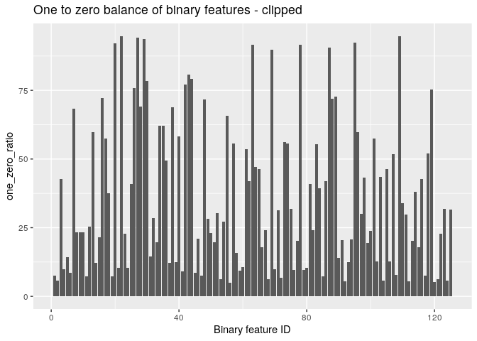
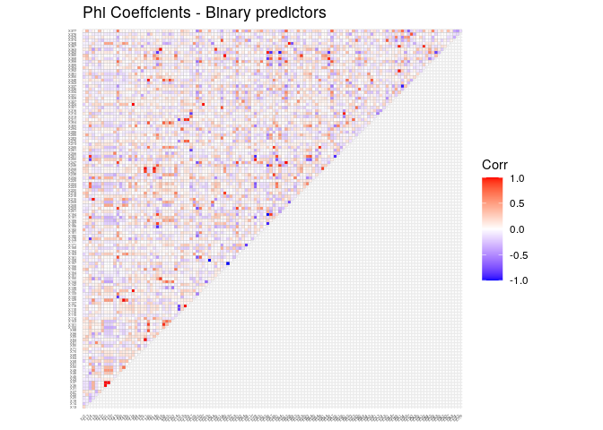

# Predicting testing times of Mercedes-Benz automobiles

Introduction
============

This dataset contains an anonymized set of variables, each representing
a custom feature in a Mercedes vehicle. For example, a variable could be
4WD, added air suspension, or a head-up display. The ground truth is
labeled ‘y’ and represents the time that the car needed to pass testing.
The goal is to predict that time, with *R*<sup>2</sup> as the error
metric.

Exploratory Data Analysis and Feature Engineering
=================================================

General
-------

Let’s read in the data:

``` r
# Requirements
require(dplyr)
require(ggplot2)
require(diagrammeR)
require(Matrix)
require(xgboost)
require(gridExtra)
require(reshape2)
require(ggcorrplot)
require(hclust)
require(doParallel)
require(mlr)
require(caret)
require(parallelMap)
require(ParamHelpers)

df <- read.csv("train.csv")
```

From the description of the competition we know there’s have an ID, a
response, a bunch categorigal features, and a bigger bunch of binary
features. Let’s convert the categorical predictors to factors:

``` r
df <- df %>%
  mutate_at(vars(X0, X1, X2, X3, X4, X5, X6, X8), as.factor)
```

A check for missing values:

``` r
any(is.na.data.frame(df))
```

    ## [1] FALSE

No missing values.

Let’s see how many unique values we have in each feature:

``` r
uniques <- apply(df, 2, function(x) length(unique(x))) 

data.frame(names = names(uniques), values = uniques) %>%
  filter(names != "y" & names != "ID") %>%
  ggplot(aes(x = 1:length(values), y = values)) + geom_line() + ggtitle('No. of unique values of features')
```



The majority of the features are binary (prone to overfitting), but
there are also some features with just one value. Let’s isolate and
remove those, since they don’t have any predictive power:

``` r
drop_cols <- apply(df, 2, function(x) length(unique(x)) < 2)

df <- df[, !drop_cols]
```

Alright, up to now we have an ID variable, a couple of categorical
features (X0 - X8 as can be seen in the dataframe), and a very high
number of binary features. Let’s break down the features into these
three subsets and take a look into them one-by-one:

ID variable
-----------

I don’t expect the ID of the vehicle to tell us that much, but I
wouldn’t be surprised if cars with a lower ID tend to spend more time on
the test bench. Let’s have a look:

``` r
ggplot(data = df, aes(x = ID, y = y)) + geom_line() + ggtitle('ID vs testing time')
```


Indeed, no visible patterns. We can drop ID. Furthermore we can see that
there is a very high response value (more than 260), let’s clip that
observation:

``` r
df <- df %>%
  select(-ID) %>%
  filter(y <= 250)
```

Response variable
-----------------

Let’s have a closer look at the response:

``` r
p1 <- ggplot(df, aes(x = y)) + geom_histogram(binwidth = 3) + 
  ggtitle("Distribution of the response")

p2 <- df %>%
  filter(y <= 250) %>%
  ggplot(., aes(sample = y)) + stat_qq() + stat_qq_line() + ggtitle("Normal Q-Q plot of the response")

grid.arrange(p1, p2, nrow = 2)
```


Far from normal. We could apply a transformation at this point (log,
sqrt, Box-Cox), we’ll do so if it becomes necessary later on.

Alright, we need to do the following: (1) Find important features (2)
identify interactions among predictors (if any) and (3) reduce
dimensionality.

Multi-valued factors
--------------------

First, let’s have a look at the few multi-valued factors X0 - X8, and
how these affect the response. Starting with how many unique categories
we have for each one of them:

``` r
factors <- c("X0", "X1", "X2", "X3", "X4", "X5", "X6", "X8")

uniques <- apply(df, 2, function(x) length(unique(x)))[2:9] 
  
data.frame(factors = factors, unique.vals = uniques) %>%
  ggplot(aes(x = factors, y = unique.vals)) + geom_bar(stat="identity") + ggtitle("No. of factors per categorical predictor")
```


Quite a few categories within each factor. A blind one-hot encoding
might not be such a good idea.

Closer look at X0:

``` r
# Box plot
ggplot(df, aes(x = X0, y = y)) + geom_boxplot() + ggtitle("Response per category - X0")
```


Categories AA (high response values) and AZ/BC (lowest response values)
stand out. Furthermore, if we ignore outliers, we can see in general two
types of responses for X0. A relatively low response (below 100) for
multiple categories (AC, AD, AF and so on), and high response values
(above 100) for the rest of them. Some exceptions exist of course, like
category K. It might be possible to group all these categories into a
few key super-categories.

AB, AC, G seem to have just one value. Let’s confirm this:

``` r
for (elem in c("ab", "ac", "g"))
{
  print(paste(elem, ":", sum(df$X0 == elem)))
}
```

    ## [1] "ab : 1"
    ## [1] "ac : 1"
    ## [1] "g : 1"

Let’s see how many times each category appears in general:

``` r
df %>%
  count(X0) %>%
  ggplot(aes(x = X0, y = n)) + geom_bar(stat = "identity") + geom_abline(slope = 0, intercept = 20,  col = "red", lty = 2) + 
  ggtitle("Observations per category - X0")
```


There are quite a few categories that appear very infrequently - the red
line indicates 20 appearances. We could goup them in a buffer “other”
category, or merge them with the rest. Let’s try clustering the
observations, using median and interquantile range values:

``` r
# Get median and IQR
x0_lookup <- df %>%
  select(X0, y) %>%
  group_by(X0) %>%
  summarise(range = max(y) - min(y),
            median = median(y)) %>%
  ungroup %>%
  as.data.frame()
```

    ## `summarise()` ungrouping output (override with `.groups` argument)

``` r
# Scale and center
x0.sum_scaled <- x0_lookup %>%
    select(-X0) %>%
    scale

# Try different k and plot elbow diagram
set.seed(25)

kappas <- 3:15

wss <- sapply(kappas, function(k){kmeans(x0.sum_scaled, k, nstart = 100, iter.max = 60)$tot.withinss})

data.frame(kappa = kappas, wss = wss) %>%
  ggplot(aes(x = kappa, y = wss)) + geom_line() + geom_point() + ggtitle("Elbow diagram - X0 category clustering") + 
  ylab("within-clusters sum of squares") + xlab("No. of clusters")
```


We can see that for a cluster size higher than 5, the between/total ss
ratio starts decreasing at a slower rate. Let’s visualize the results:

``` r
set.seed(25)

# Extract culster centers
x0.centers <- kmeans(x0.sum_scaled, centers = 5, nstart = 100)$centers

# Function to give the cluster for each variable
find_clusters <- function(x, centers) {
  # compute squared euclidean distance from each sample to each cluster center
  tmp <- sapply(seq_len(nrow(x)),
                function(i) apply(centers, 1,
                                  function(v) sum((x[i, ]-v)^2)))
  max.col(-t(tmp))  # find index of min distance
}

# Get the clusters
x0_lookup$clusters <- as.factor(apply(x0.sum_scaled, 1, function(x) find_clusters(t(as.vector(x)), x0.centers)) )

# Plot them
x0_lookup %>%
  ggplot(aes(x = range, y = median, color = clusters)) + geom_point() + ggtitle("X0 clustered categories") + 
  geom_text(aes(label = X0), nudge_x = 0, nudge_y = 5, size = 3)
```


AB, G, R (i.e. cluster 3) should be moved to cluster 5, and K to cluster
4. They will not change the distribution of the grouped categories, due
to the relatively low number of observations they have:. Let’s apply
this and see how the clustered boxplot for X0 looks like:

``` r
# Split values into high (H) and low (L) expected response regions
x0_lookup <- x0_lookup %>%
  select(X0, clusters) %>%
  setNames(., c("X0", "X0_new"))

# Append the new categories for X0
df <- plyr::join(df, x0_lookup, by = "X0") %>%
  mutate(X0_new = as.factor(X0_new))

# Box plots
p1 <- ggplot(df, aes(x = X0, y = y, color = X0_new)) + geom_boxplot() + ggtitle("X0 Clustered categories - Boxplots")

p2 <- ggplot(df, aes(x = X0_new, y = y)) + geom_boxplot()

grid.arrange(p1, p2, ncol = 1)
```


That looks better.

Moving on to X1:

``` r
ggplot(df, aes(x = X1, y = y)) + geom_boxplot() + ggtitle("Response per category - X1")
```


There doesn’t seem to be that much variation in response among the
different categories, apart from category Y. Distribution of values:

``` r
df %>%
  count(X1) %>%
  ggplot(aes(x = X1, y = n)) + geom_bar(stat = "identity")  + geom_abline(slope = 0, intercept = 20,  col = "red", lty = 2) + ggtitle("Observations per category - X1") 
```


A few categories seem to account for around 80% of the total training
set. The only value for X1 that shows significant differences in the
response is category “Y”, but then again its only 20 observations having
that value.

Let’s try X2:

``` r
ggplot(df, aes(x = X2, y = y)) + geom_boxplot() + ggtitle("Response per category - X2")
```


We could group these categories as well, but first let’s have a look at
how many times each category appears:

``` r
df %>%
  count(X2) %>%
  ggplot(aes(x = X2, y = n)) + geom_bar(stat = "identity")  + geom_abline(slope = 0, intercept = 60,  col = "red", lty = 2) +
  ggtitle("Observations per category - X2")
```


This is interesting. One dominant category (AS), 4 moderately occuring
ones (AE, AI, AK, M), and then the rest. We could use a similar approach
as for X0, but with such a low number of observations for the different
categories, the criteria we’ll be using for clustering are questionable.
Let’s make one buffer for all categories that appear less than 60 times,
i.e. below the red line of the figure above and see how the new boxplot
looks like:

``` r
# Split values into high (H) and low (L) expected response regions
x2_lookup <- df %>%
  select(X2, y) %>%
  count(X2) %>%
  mutate(X2 = as.character(X2)) %>%
  mutate(X2_new = ifelse(n <= 60, "other", X2)) %>%
  select(X2, X2_new) %>%
  mutate_all(funs(as.factor))

# Append the new categories for X2
df <- plyr::join(df, x2_lookup, by = "X2") %>%
  mutate(X2_new = as.factor(X2_new))

# Box plot
ggplot(df, aes(x = X2_new, y = y)) + geom_boxplot() + ggtitle("Grouped categories - X2")
```


We can combine the rest of the categories by eyeballing the boxplot:

-   Cat. 1: AE, M, AI, F
-   Cat. 2: AK, E, AS, other
-   Cat. 3: AQ, R
-   Cat. 4: S
-   Cat. 5: N

``` r
df$X2 <- as.character(df$X2)
df$X2_new <- as.character(df$X2_new)
df[df$X2 %in% c("ae", "m", "ai", "f"), "X2_new"] <- 1
df[df$X2 %in% c("ak", "e", "as", "other"), "X2_new"] <- 2
df[df$X2 %in% c("aq", "r"), "X2_new"] <- 3
df[df$X2 == "s", "X2_new"] <- 4
df[df$X2 == "n", "X2_new"] <- 5

df <- df %>%
  mutate(X2 = as.factor(X2)) %>%
  mutate(X2_new = as.factor(X2_new))

# Box plot
ggplot(df, aes(x = X2_new, y = y)) + geom_boxplot() + ggtitle("Grouped categories - X2")
```



Next up, X3 X4, X6 - they all have a limited number of possible values:

``` r
p1 <- ggplot(df, aes(x = X3, y = y)) + geom_boxplot()

p2 <- ggplot(df, aes(x = X4, y = y)) + geom_boxplot()

p3 <- ggplot(df, aes(x = X6, y = y)) + geom_boxplot()

grid.arrange(p1, p2, p3, nrow=2, ncol=2)
```



None of them seems to present different responses with respect to
distinct categories, X4 seems to be doing so, but that’s probably
beacuse of the limited occurences of different categories:

``` r
df %>%
  count(X4)
```

    ##   X4    n
    ## 1  a    2
    ## 2  b    1
    ## 3  c    1
    ## 4  d 4204

Indeed, just three occurences for categories different than d.

Moving on to X5:

``` r
# Box plot
p1 <- ggplot(df, aes(x = X5, y = y)) + geom_boxplot() + ggtitle("Response and no. observations per category - X5")

p2 <- df %>%
  count(X5) %>%
  ggplot(aes(x = X5, y = n)) + geom_bar(stat = "identity")  + geom_abline(slope = 0, intercept = 60,  col = "red", lty = 2)

grid.arrange(p1, p2, nrow = 2)
```


No significant differences among categories with a significant number of
observations.

This leaves us with X8:

``` r
# Box plot
p1 <- ggplot(df, aes(x = X8, y = y)) + geom_boxplot() + ggtitle("Response and no. observations per category - X8")

p2 <- df %>%
  count(X8) %>%
  ggplot(aes(x = X8, y = n)) + geom_bar(stat = "identity")  + geom_abline(slope = 0, intercept = 60,  col = "red", lty = 2)

grid.arrange(p1, p2, nrow = 2)
```


Same picture as X3 and X6, no statistically significant differences in
the response.

To sum this up, we’ve reduced the cardinality of X0 and X2, and we know
that the rest of the categorical variables do not seem to have any
significant predictive power.

Binary predictors
-----------------

Let’s have a closer look at the binary features. If each binary
predictor is a dummy variable indicating wheter or not a specific car
has a feature (ordinal binary data), it would make sense that a higher
number of features results in increased testing time. Let’s have a look:

``` r
bin.sums <- df[, 10:365] %>% # Binary predictors only
  mutate_all(funs(as.numeric)) %>% # Sums don't work otherwise
  rowSums() %>%
  data.frame() %>%
  mutate(y = df$y) %>% # Add response 
  setNames(., c("Bin.Sum", "target"))

ggplot(bin.sums, aes(x = Bin.Sum, y = target)) + geom_point() + geom_smooth(method = "lm") + xlab("Sum of binary predictors") + ggtitle("Sum of binary predictors vs. target variable")
```

    ## `geom_smooth()` using formula 'y ~ x'


Honestly, I was expecting something better. Let’s have a look at the
one-to-zero ratio:

``` r
bin.cols <- 10:365

bin.df <- df[, bin.cols]

bin.features <- data.frame(feature = colnames(df[, bin.cols]), one_zero_ratio = apply(df[, bin.cols], 2, function(x) sum(as.numeric(x)) / nrow(df) * 100))

ggplot(bin.features, aes(x = 1:nrow(bin.features), y = one_zero_ratio)) + geom_bar(stat="identity") + 
  xlab("Binary feature ID") + ggtitle("One to zero balance of binary features - original") + 
  geom_abline(slope = 0, intercept = 5,  col = "red", lty = 2) + 
  geom_abline(slope = 0, intercept = 95,  col = "red", lty = 2)
```


The height of the columns is the number of unity values (as a percentage
of all values), for each predictor. There are several predictors that
have a percentage of unity or zero values close to 100%. Of course,
these do not hold any predictive value. Let’s clip the highly imbalanced
proportions (imbalanced in this case means a ratio lying outside the
95/05 margin, given by the red lines):

``` r
bin.features.clipped <- bin.features %>%
  filter(one_zero_ratio < 95 & one_zero_ratio > 5)

ggplot(bin.features.clipped, aes(x = 1:nrow(bin.features.clipped), y = one_zero_ratio)) + geom_bar(stat="identity") + 
  xlab("Binary feature ID") + ggtitle("One to zero balance of binary features - clipped") 
```



We’re left with 125 binary predictors. We need to identify if there are
sets of features that are associated with each other. Given that we’re
dealing with binary data, the phi (mean square contingency) coefficient
is suitable. Considering that the phi coefficient is just the Pearson
correlation applied to dichotomous (binary) data, we can get away with
just using the built-in cor() function:

``` r
# Remove imbalanced predictors from the dset
bin.cols <- which(colnames(bin.df) %in% bin.features.clipped$feature)

bin.df <- bin.df[, bin.cols]

# Make a correlation matirx
corr <- bin.df %>%
  mutate_all(funs(as.numeric)) %>%
  cor

# Plot
ggcorrplot(corr, type = "upper", show.diag = F, title = "Phi Coeffcients - Binary predictors") + 
  theme(axis.text.x = element_text(size = 3), axis.text.y = element_text(size = 3))
```



There is a bit of redundancy in there. Caret has a very convenient
function that automatically reduces pair-wise correlations by searching
a correlation matrix:

``` r
# Get indices of redundant predictors
reduced.bin.predictors <- findCorrelation(abs(corr), cutoff = 0.7, names = F)

# Remove them from the list of binary columns
bin.df <- bin.df[, -c(reduced.bin.predictors)]

print(paste("Current no. of binary predictors:", ncol(bin.df)))
```

    ## [1] "Current no. of binary predictors: 67"

Individual Feature importance
-----------------------------

Let’s do one-hot encoding on the categorical features and then rank
everything using XGBoost:

``` r
# Reproducibility
set.seed(10)

# Keep relevant features only
dfNew <- bin.df %>%
  mutate(y = df$y) %>%
  mutate(X0 = df$X0_new) %>%
  mutate(X2 = df$X2_new)

get_feature_importance <- function(data)
{
  # Model matrix
  sparse_mtrx <- sparse.model.matrix(y~. -1, data)
  
  # XGBoost
  xgb <- xgboost(data = sparse_mtrx, 
                 label = data$y, 
                 booster = "dart",  
                 nthread = 4, 
                 nrounds = 250, 
                 verbose = 0)
  
  # Get feature importance
  important_features <- xgb.importance(feature_names = sparse_mtrx@Dimnames[[2]], model = xgb)
  
  return(list("mtrx" = sparse_mtrx, "mdl" = xgb, "feats" = important_features))
}

important_feats <- get_feature_importance(dfNew)

# Unpack
xgb <- important_feats$mdl
importance <- important_feats$feats
sparse_mtrx <- important_feats$sparse_mtrx

head(importance)
```

    ##    Feature        Gain       Cover   Frequency
    ## 1:     X04 0.502059474 0.017575709 0.013337567
    ## 2:    X189 0.105751173 0.006215019 0.001746586
    ## 3:    X261 0.060671580 0.009983094 0.016671959
    ## 4:     X02 0.027979303 0.012310067 0.004922198
    ## 5:    X115 0.017213604 0.028217528 0.040489044
    ## 6:    X137 0.008992754 0.019045763 0.028739282

Interesting. Two features account for 60% of the gain. Let’s visualize
cumulative Gain:

``` r
importance <- importance %>%
  mutate(Cumul.Gain = cumsum(Gain)) %>%
  select(Feature, Gain, Cumul.Gain)

p1 <- ggplot(importance, aes(x = 1:nrow(importance), y = Cumul.Gain)) + geom_line() + xlab("Feature ID") + 
  ggtitle("Cumulative Gain by feature")

p2 <- head(importance, 20) %>%
  ggplot(., aes(x = 1:nrow(.), y = Cumul.Gain)) + geom_line() + xlab("Feature ID") 

grid.arrange(p1, p2, nrow = 1)
```


Indeed, the first 4 features account for 70% of the gain, whereas the
first 15 features account for roughly 80% of it.

Interaction terms
-----------------

Let’s have a look at interactions - if they exist at all:

``` r
xgb.plot.tree(feature_names = colnames(sparse_mtrx), model = xgb, trees = 0:1)
```

    ## PhantomJS not found. You can install it with webshot::install_phantomjs(). If it is installed, please make sure the phantomjs executable can be found via the PATH variable.

<!--html_preserve-->

<script type="application/json" data-for="htmlwidget-99254d78a1a2709de0d2">{"x":{"diagram":"digraph {\n\ngraph [layout = \"dot\",\n       rankdir = \"LR\"]\n\nnode [color = \"DimGray\",\n      style = \"filled\",\n      fontname = \"Helvetica\"]\n\nedge [color = \"DimGray\",\n     arrowsize = \"1.5\",\n     arrowhead = \"vee\",\n     fontname = \"Helvetica\"]\n\n  \"1\" [label = \"Tree 1\nX04\nCover: 4208\nGain: 114944\", shape = \"rectangle\", fontcolor = \"black\", fillcolor = \"Beige\"] \n  \"2\" [label = \"X189\nCover: 2852\nGain: 24705\", shape = \"rectangle\", fontcolor = \"black\", fillcolor = \"Beige\"] \n  \"3\" [label = \"X115\nCover: 1356\nGain: 3358.5\", shape = \"rectangle\", fontcolor = \"black\", fillcolor = \"Beige\"] \n  \"4\" [label = \"Leaf\nCover: 183\nValue: 16.2670116\", shape = \"oval\", fontcolor = \"black\", fillcolor = \"Khaki\"] \n  \"5\" [label = \"X261\nCover: 2669\nGain: 13692\", shape = \"rectangle\", fontcolor = \"black\", fillcolor = \"Beige\"] \n  \"6\" [label = \"Leaf\nCover: 1247\nValue: 23.5662556\", shape = \"oval\", fontcolor = \"black\", fillcolor = \"Khaki\"] \n  \"7\" [label = \"Leaf\nCover: 109\nValue: 20.6715508\", shape = \"oval\", fontcolor = \"black\", fillcolor = \"Khaki\"] \n  \"8\" [label = \"X02\nCover: 2152\nGain: 5276\", shape = \"rectangle\", fontcolor = \"black\", fillcolor = \"Beige\"] \n  \"9\" [label = \"Leaf\nCover: 517\nValue: 21.7579365\", shape = \"oval\", fontcolor = \"black\", fillcolor = \"Khaki\"] \n  \"10\" [label = \"Leaf\nCover: 2089\nValue: 19.6566544\", shape = \"oval\", fontcolor = \"black\", fillcolor = \"Khaki\"] \n  \"11\" [label = \"Leaf\nCover: 63\nValue: 23.3905487\", shape = \"oval\", fontcolor = \"black\", fillcolor = \"Khaki\"] \n  \"12\" [label = \"Tree 0\nX04\nCover: 4208\nGain: 235272\", shape = \"rectangle\", fontcolor = \"black\", fillcolor = \"Beige\"] \n  \"13\" [label = \"X189\nCover: 2852\nGain: 51268\", shape = \"rectangle\", fontcolor = \"black\", fillcolor = \"Beige\"] \n  \"14\" [label = \"Leaf\nCover: 1356\nValue: 33.34515\", shape = \"oval\", fontcolor = \"black\", fillcolor = \"Khaki\"] \n  \"15\" [label = \"Leaf\nCover: 183\nValue: 23.1845894\", shape = \"oval\", fontcolor = \"black\", fillcolor = \"Khaki\"] \n  \"16\" [label = \"X261\nCover: 2669\nGain: 27598\", shape = \"rectangle\", fontcolor = \"black\", fillcolor = \"Beige\"] \n  \"17\" [label = \"X02\nCover: 2152\nGain: 9212\", shape = \"rectangle\", fontcolor = \"black\", fillcolor = \"Beige\"] \n  \"18\" [label = \"Leaf\nCover: 517\nValue: 31.0570736\", shape = \"oval\", fontcolor = \"black\", fillcolor = \"Khaki\"] \n  \"19\" [label = \"Leaf\nCover: 2089\nValue: 28.0751801\", shape = \"oval\", fontcolor = \"black\", fillcolor = \"Khaki\"] \n  \"20\" [label = \"Leaf\nCover: 63\nValue: 33.1927986\", shape = \"oval\", fontcolor = \"black\", fillcolor = \"Khaki\"] \n\"1\"->\"2\" [label = \"< -9.53674316e-07\", style = \"bold\"] \n\"2\"->\"4\" [label = \"< -9.53674316e-07\", style = \"bold\"] \n\"3\"->\"6\" [label = \"< -9.53674316e-07\", style = \"bold\"] \n\"5\"->\"8\" [label = \"< -9.53674316e-07\", style = \"bold\"] \n\"8\"->\"10\" [label = \"< -9.53674316e-07\", style = \"bold\"] \n\"12\"->\"13\" [label = \"< -9.53674316e-07\", style = \"bold\"] \n\"13\"->\"15\" [label = \"< -9.53674316e-07\", style = \"bold\"] \n\"16\"->\"17\" [label = \"< -9.53674316e-07\", style = \"bold\"] \n\"17\"->\"19\" [label = \"< -9.53674316e-07\", style = \"bold\"] \n\"1\"->\"3\" [style = \"bold\", style = \"solid\"] \n\"2\"->\"5\" [style = \"solid\", style = \"solid\"] \n\"3\"->\"7\" [style = \"solid\", style = \"solid\"] \n\"5\"->\"9\" [style = \"solid\", style = \"solid\"] \n\"8\"->\"11\" [style = \"solid\", style = \"solid\"] \n\"12\"->\"14\" [style = \"solid\", style = \"solid\"] \n\"13\"->\"16\" [style = \"solid\", style = \"solid\"] \n\"16\"->\"18\" [style = \"solid\", style = \"solid\"] \n\"17\"->\"20\" [style = \"solid\", style = \"solid\"] \n}","config":{"engine":"dot","options":null}},"evals":[],"jsHooks":[]}</script>
<!--/html_preserve-->

We can see two-way interactions among the following pairs:

-   X0 and X189
-   X0 and X115

and three-way interaction among X0, X189 and X261. Let’s add those as
features:

``` r
dfNew <- dfNew %>%
  mutate(X0_189 = X0:as.factor(X189)) %>%
  mutate(X0_115 = X0:as.factor(X115)) %>%
  mutate(X0_189_261 = X0:as.factor(X189):as.factor(X261))

str(dfNew[, c("X0_189", "X0_115", "X0_189_261")])
```

    ## 'data.frame':    4208 obs. of  3 variables:
    ##  $ X0_189    : Factor w/ 10 levels "1:0","1:1","2:0",..: 6 6 9 9 9 6 6 6 8 8 ...
    ##  $ X0_115    : Factor w/ 10 levels "1:0","1:1","2:0",..: 5 5 9 9 9 5 6 5 7 7 ...
    ##  $ X0_189_261: Factor w/ 20 levels "1:0:0","1:0:1",..: 11 11 17 17 17 11 11 11 16 16 ...

The three-way interaction does complicate the model. We’ve introduced 20
extra factor levels with the two-way interactions (which will result
into 20 extra dimensions after the one-hot encoding), plus an extra 20
for the three-way interaction. For now, We’ll move ahead with the
two-way interactions only, and include the third one later on (if
necessary):

``` r
dfNew <- dfNew %>%
  select(- X0_189_261)
```

Let’s see the most common value pairs for the interaction terms:

``` r
dfNew %>%
  select(X0_189, X0_115) %>%
  table()
```

    ##       X0_115
    ## X0_189  1:0  1:1  2:0  2:1  3:0  3:1  4:0  4:1  5:0  5:1
    ##    1:0    0    0    0    0    0    0    0    0    0    0
    ##    1:1    2    0    0    0    0    0    0    0    0    0
    ##    2:0    0    0    1    0    0    0    0    0    0    0
    ##    2:1    0    0  111    5    0    0    0    0    0    0
    ##    3:0    0    0    0    0    1    0    0    0    0    0
    ##    3:1    0    0    0    0 1337 1041    0    0    0    0
    ##    4:0    0    0    0    0    0    0  163   10    0    0
    ##    4:1    0    0    0    0    0    0 1084   99    0    0
    ##    5:0    0    0    0    0    0    0    0    0  181    0
    ##    5:1    0    0    0    0    0    0    0    0  127   46

There are some pairs that appear just once, twice or 5 times. There is a
chance that these will be flagged as outliers later on, so let’s see
which observations these are:

``` r
unusual_interactions <- which((dfNew$X0_189 == "3:1" & dfNew$X0_115 == "3:0") | (dfNew$X0_189 == "4:0" & dfNew$X0_115 == "4:0") | (dfNew$X0_189 == "5:0" & dfNew$X0_115 == "5:0") | (dfNew$X0_189 == "5:1" & dfNew$X0_115 == "5:1"))

unusual_interactions
```

    ##    [1]    1    2    3    4    5    6    8   15   16   19   21   22   26   28
    ##   [15]   29   31   34   39   42   43   53   54   56   60   63   66   69   71
    ##   [29]   74   75   77   83   85   88   89   92   94  100  102  105  108  109
    ##   [43]  116  117  123  127  129  130  132  135  137  141  143  145  146  151
    ##   [57]  153  155  161  163  165  167  169  176  179  181  183  184  185  186
    ##   [71]  188  192  194  196  198  200  201  205  208  209  213  216  220  221
    ##   [85]  227  229  230  232  235  240  242  243  244  245  252  254  255  257
    ##   [99]  259  261  263  266  267  271  272  275  278  281  282  288  290  292
    ##  [113]  294  295  296  297  298  300  303  305  309  311  312  313  316  322
    ##  [127]  323  325  329  333  335  336  342  345  348  357  358  361  363  364
    ##  [141]  365  366  367  369  370  373  374  375  377  379  381  384  389  391
    ##  [155]  396  397  399  400  401  406  412  414  415  416  418  419  422  429
    ##  [169]  433  435  440  441  442  448  450  452  453  455  457  460  463  465
    ##  [183]  467  469  470  471  476  482  483  484  488  490  492  494  495  496
    ##  [197]  502  503  504  507  512  513  515  517  520  521  522  528  530  531
    ##  [211]  537  541  546  547  549  551  555  558  566  568  572  574  576  577
    ##  [225]  579  581  584  589  592  594  595  597  599  601  604  605  609  613
    ##  [239]  617  620  623  624  625  627  629  632  638  643  644  645  646  650
    ##  [253]  653  654  656  659  665  668  670  675  678  683  685  687  689  690
    ##  [267]  693  694  697  703  704  706  707  708  709  711  713  715  718  723
    ##  [281]  727  728  729  731  734  735  736  739  744  749  750  754  757  762
    ##  [295]  765  767  770  771  773  776  777  782  785  786  788  790  792  793
    ##  [309]  794  795  801  805  807  809  811  812  817  819  820  823  826  828
    ##  [323]  830  831  832  834  835  836  840  842  843  850  851  852  853  857
    ##  [337]  859  862  864  865  868  870  871  873  875  877  886  888  890  894
    ##  [351]  895  897  898  901  904  907  912  915  916  917  918  921  923  924
    ##  [365]  925  929  930  932  933  936  938  943  944  946  947  952  959  960
    ##  [379]  961  963  970  972  974  975  976  977  980  982  986  991  996 1000
    ##  [393] 1005 1009 1011 1012 1014 1016 1017 1018 1023 1024 1025 1029 1030 1031
    ##  [407] 1032 1038 1039 1046 1049 1053 1056 1057 1063 1065 1066 1070 1071 1075
    ##  [421] 1076 1078 1079 1081 1083 1085 1087 1096 1104 1105 1106 1109 1110 1112
    ##  [435] 1114 1116 1118 1119 1121 1122 1124 1126 1128 1130 1131 1132 1133 1134
    ##  [449] 1138 1141 1142 1149 1151 1154 1155 1158 1161 1162 1165 1167 1168 1170
    ##  [463] 1177 1179 1181 1182 1183 1187 1189 1191 1192 1194 1197 1199 1207 1208
    ##  [477] 1212 1214 1216 1219 1225 1226 1230 1233 1234 1235 1237 1240 1242 1244
    ##  [491] 1249 1252 1253 1255 1256 1258 1262 1264 1270 1274 1275 1280 1281 1282
    ##  [505] 1283 1284 1286 1291 1293 1295 1296 1297 1300 1301 1303 1306 1307 1309
    ##  [519] 1311 1312 1316 1317 1318 1320 1322 1323 1326 1332 1334 1336 1337 1338
    ##  [533] 1340 1342 1344 1346 1351 1352 1354 1357 1358 1359 1363 1365 1368 1374
    ##  [547] 1375 1376 1379 1380 1381 1383 1384 1386 1388 1390 1392 1393 1395 1396
    ##  [561] 1398 1400 1401 1405 1409 1410 1412 1414 1418 1419 1424 1431 1434 1439
    ##  [575] 1443 1445 1449 1452 1455 1458 1459 1463 1466 1467 1469 1470 1472 1474
    ##  [589] 1475 1479 1480 1482 1485 1486 1489 1499 1503 1504 1506 1507 1508 1511
    ##  [603] 1512 1513 1514 1518 1520 1522 1527 1530 1531 1532 1533 1537 1538 1546
    ##  [617] 1548 1549 1551 1553 1554 1558 1566 1567 1568 1569 1576 1582 1585 1586
    ##  [631] 1589 1592 1594 1595 1596 1597 1601 1602 1603 1607 1608 1609 1611 1612
    ##  [645] 1617 1619 1620 1625 1630 1632 1634 1635 1638 1641 1642 1643 1646 1647
    ##  [659] 1649 1651 1653 1655 1657 1659 1662 1665 1666 1669 1670 1672 1674 1676
    ##  [673] 1680 1681 1682 1686 1690 1692 1693 1694 1697 1698 1699 1700 1701 1702
    ##  [687] 1704 1707 1709 1713 1715 1718 1722 1723 1724 1725 1732 1733 1734 1736
    ##  [701] 1742 1743 1745 1747 1750 1753 1755 1756 1760 1762 1767 1770 1771 1773
    ##  [715] 1775 1777 1779 1781 1783 1788 1791 1793 1795 1798 1801 1803 1805 1809
    ##  [729] 1816 1818 1823 1825 1827 1831 1837 1838 1841 1846 1848 1850 1853 1858
    ##  [743] 1860 1863 1864 1868 1869 1870 1871 1879 1881 1883 1884 1885 1886 1890
    ##  [757] 1891 1897 1898 1909 1910 1912 1917 1918 1919 1920 1923 1926 1929 1931
    ##  [771] 1933 1935 1939 1941 1943 1947 1950 1952 1953 1956 1957 1959 1961 1963
    ##  [785] 1965 1967 1968 1970 1973 1975 1977 1978 1983 1985 1990 1991 1993 1994
    ##  [799] 1997 1998 2005 2011 2012 2015 2017 2020 2021 2024 2025 2030 2031 2032
    ##  [813] 2039 2040 2041 2045 2047 2049 2054 2056 2057 2064 2073 2074 2078 2081
    ##  [827] 2083 2085 2086 2088 2089 2091 2092 2095 2097 2099 2101 2102 2106 2107
    ##  [841] 2108 2110 2112 2114 2115 2116 2117 2119 2124 2125 2128 2129 2131 2133
    ##  [855] 2136 2141 2152 2153 2154 2156 2160 2161 2162 2163 2165 2166 2167 2168
    ##  [869] 2169 2171 2172 2174 2175 2176 2178 2179 2181 2187 2188 2192 2194 2196
    ##  [883] 2200 2202 2203 2206 2207 2210 2216 2217 2219 2221 2223 2225 2226 2227
    ##  [897] 2230 2232 2233 2234 2239 2244 2245 2248 2249 2251 2257 2259 2261 2264
    ##  [911] 2267 2268 2271 2276 2277 2278 2280 2282 2286 2290 2291 2292 2296 2297
    ##  [925] 2298 2299 2306 2307 2308 2313 2317 2319 2321 2326 2328 2332 2333 2335
    ##  [939] 2336 2338 2341 2342 2344 2345 2346 2347 2349 2351 2352 2354 2360 2363
    ##  [953] 2364 2365 2367 2368 2372 2374 2378 2379 2384 2385 2387 2391 2392 2398
    ##  [967] 2401 2404 2405 2407 2408 2409 2413 2414 2415 2416 2417 2421 2425 2426
    ##  [981] 2427 2430 2432 2434 2436 2437 2440 2442 2443 2449 2452 2453 2455 2458
    ##  [995] 2460 2461 2464 2465 2466 2467 2469 2471 2472 2475 2477 2479 2481 2482
    ## [1009] 2483 2485 2489 2490 2493 2495 2499 2503 2504 2507 2509 2511 2515 2517
    ## [1023] 2518 2522 2523 2526 2529 2534 2535 2537 2540 2541 2542 2547 2548 2549
    ## [1037] 2552 2553 2554 2557 2558 2562 2567 2569 2571 2573 2575 2577 2581 2583
    ## [1051] 2584 2586 2588 2589 2590 2591 2593 2596 2597 2598 2600 2602 2604 2610
    ## [1065] 2611 2614 2617 2618 2619 2621 2622 2623 2624 2631 2634 2638 2642 2643
    ## [1079] 2645 2652 2659 2660 2662 2663 2665 2667 2668 2669 2671 2673 2675 2677
    ## [1093] 2682 2683 2684 2685 2687 2688 2691 2693 2694 2696 2698 2703 2705 2707
    ## [1107] 2710 2711 2715 2716 2717 2718 2720 2721 2726 2727 2728 2730 2731 2738
    ## [1121] 2746 2748 2749 2750 2754 2757 2758 2760 2762 2764 2766 2768 2769 2770
    ## [1135] 2776 2782 2783 2786 2792 2794 2795 2800 2803 2809 2814 2816 2819 2821
    ## [1149] 2825 2829 2832 2833 2837 2838 2840 2841 2843 2846 2847 2849 2852 2853
    ## [1163] 2855 2856 2858 2861 2869 2871 2872 2876 2880 2881 2884 2890 2893 2896
    ## [1177] 2897 2899 2902 2904 2906 2907 2909 2910 2914 2915 2917 2918 2919 2921
    ## [1191] 2925 2926 2927 2928 2929 2932 2934 2935 2942 2943 2944 2949 2951 2953
    ## [1205] 2959 2961 2965 2970 2974 2976 2979 2984 2985 2987 2989 2990 2993 2994
    ## [1219] 2998 3000 3002 3004 3008 3009 3010 3013 3014 3016 3018 3020 3022 3025
    ## [1233] 3027 3028 3031 3032 3036 3037 3041 3043 3046 3051 3052 3054 3055 3056
    ## [1247] 3057 3059 3062 3064 3068 3069 3072 3073 3074 3080 3084 3085 3087 3090
    ## [1261] 3094 3098 3100 3102 3109 3111 3113 3115 3117 3120 3126 3128 3130 3131
    ## [1275] 3132 3134 3136 3137 3145 3147 3149 3150 3156 3157 3158 3160 3165 3167
    ## [1289] 3169 3171 3173 3174 3175 3176 3177 3183 3184 3186 3188 3191 3193 3197
    ## [1303] 3199 3202 3205 3206 3207 3208 3209 3210 3213 3214 3223 3225 3226 3228
    ## [1317] 3231 3232 3233 3239 3240 3251 3255 3256 3257 3263 3266 3268 3272 3274
    ## [1331] 3275 3276 3277 3278 3280 3281 3282 3286 3288 3290 3293 3295 3297 3298
    ## [1345] 3299 3301 3302 3305 3306 3311 3312 3313 3314 3316 3317 3319 3321 3322
    ## [1359] 3323 3330 3334 3337 3342 3344 3346 3351 3353 3354 3356 3359 3362 3364
    ## [1373] 3370 3372 3373 3375 3381 3382 3385 3387 3388 3390 3391 3394 3396 3399
    ## [1387] 3404 3405 3406 3408 3412 3414 3415 3418 3420 3423 3427 3430 3433 3438
    ## [1401] 3440 3441 3442 3443 3445 3446 3454 3456 3458 3459 3460 3461 3463 3464
    ## [1415] 3465 3467 3469 3470 3474 3477 3479 3480 3481 3483 3486 3487 3492 3493
    ## [1429] 3496 3497 3498 3499 3500 3502 3503 3504 3506 3509 3513 3514 3516 3518
    ## [1443] 3519 3520 3521 3523 3524 3528 3529 3531 3535 3541 3544 3549 3551 3553
    ## [1457] 3555 3558 3559 3563 3564 3566 3569 3572 3575 3577 3580 3582 3584 3585
    ## [1471] 3587 3588 3589 3592 3595 3597 3599 3600 3603 3604 3607 3609 3612 3613
    ## [1485] 3614 3616 3617 3618 3622 3626 3627 3635 3637 3644 3646 3654 3657 3658
    ## [1499] 3660 3662 3663 3668 3676 3682 3684 3685 3687 3688 3690 3692 3693 3694
    ## [1513] 3697 3702 3705 3709 3710 3711 3712 3713 3717 3718 3719 3721 3723 3724
    ## [1527] 3726 3727 3729 3731 3734 3735 3736 3737 3739 3741 3742 3743 3747 3749
    ## [1541] 3752 3753 3755 3756 3759 3763 3768 3770 3771 3772 3776 3777 3778 3780
    ## [1555] 3782 3787 3790 3791 3792 3794 3799 3801 3802 3804 3807 3809 3811 3812
    ## [1569] 3816 3823 3825 3827 3834 3836 3839 3842 3844 3845 3846 3847 3849 3850
    ## [1583] 3851 3854 3856 3858 3860 3862 3863 3864 3867 3873 3875 3876 3879 3882
    ## [1597] 3883 3887 3891 3892 3894 3895 3898 3903 3904 3906 3916 3918 3922 3924
    ## [1611] 3927 3928 3931 3934 3937 3938 3941 3944 3950 3958 3959 3961 3962 3964
    ## [1625] 3967 3968 3969 3970 3972 3973 3975 3976 3982 3983 3984 3985 3987 3990
    ## [1639] 3992 3996 4000 4004 4006 4007 4011 4013 4018 4019 4023 4024 4027 4029
    ## [1653] 4032 4033 4035 4037 4044 4046 4047 4050 4052 4054 4057 4060 4063 4067
    ## [1667] 4069 4071 4072 4077 4079 4082 4083 4087 4089 4091 4093 4096 4101 4102
    ## [1681] 4103 4105 4106 4110 4114 4115 4116 4119 4121 4122 4123 4124 4125 4128
    ## [1695] 4133 4136 4138 4143 4145 4147 4153 4154 4157 4158 4160 4161 4163 4164
    ## [1709] 4168 4170 4172 4175 4177 4182 4183 4185 4188 4191 4194 4195 4197 4199
    ## [1723] 4200 4201 4202 4205 4208

Let’s apply a one-hot encoding at this point:

``` r
# One-hot encoding of categorical features
dfNew_one_hot <- dfNew %>%
  model.matrix(y~.-1, .) %>%
  data.frame 
```

Outlier Search
--------------

<a href="https://www.kaggle.com/msp48731/analysis-of-clusters-and-outliers" class="uri">https://www.kaggle.com/msp48731/analysis-of-clusters-and-outliers</a>

We’ll use Hierarchical Agglomerate Clustering with complete linkage
(which - in theory - merges outliers relatively late) for the purpose of
outlier identification. As a distance metric, we’ll be using Jaccard
distance for out binary dataset:

``` r
# Get distance matrix
dist.mtrx <- dist(dfNew_one_hot, method = "binary")

# Compute clusters
h.clust <- hclust(dist.mtrx, method = "complete")

# Plot
plot(h.clust, labels = F, main = "Cluster dendrogram") + abline(h = 0.75, col = 'red')
```


There is no siginificant height decrease in any of the consecutive cuts,
at least not the ones that are visible. On the other hand, there are
some cuts that result in the formation of small clusters at a relatively
high height, around 0.75 (red line in the graph above). Let’s cut the
dendrogram at that height and have a closer look at the number of
observations per cluster:

``` r
# Cut the dendrogram
h.clust.cut <- data.frame(cluster = cutree(h.clust, h = 0.75))

h.clust.cut %>%
  group_by(cluster) %>%
  summarize(n()) %>%
  data.frame %>%
  setNames(., c("cluster_id", "counts")) %>%
  ggplot(aes(x = cluster_id, y = counts)) + geom_bar(stat = "identity") +
  geom_text(aes(label = counts), hjust = -0.5, angle = 90) + 
  ylim(0, 500) + xlab("Cluster ID") + ylab("No. of observations") + ggtitle("Observations per cluster (height = .75)")
```

    ## `summarise()` ungrouping output (override with `.groups` argument)


Indeed, there are clusters with a very limited number of observations in
them (1 to 10). Let’s isolate these observations and have a closer look:

``` r
small.clusters <- h.clust.cut %>%
  group_by(cluster) %>%
  summarize(n()) %>%
  data.frame %>%
  setNames(., c("cluster_id", "counts")) %>%
  filter(counts < 10) 
```

    ## `summarise()` ungrouping output (override with `.groups` argument)

``` r
isolated.obs <- which(h.clust.cut$cluster %in% small.clusters$cluster_id)

isolated.obs
```

    ##  [1]   36   49  319  425  480  525  545  586  677  962 1341 1356 1369 1497 1521
    ## [16] 1525 1528 1621 1667 1759 2269 2287 2320 2719 2908 3090 3221 3395 3482 3510
    ## [31] 3605 3620 3828 3896 3978 3997 4036

These are the observations that were clustered by themselves into three
different clusters (cluster IDs: 44, 46, 47, 49). Observations 425, 1521
and 2287 are possibly flagged as outlier due to their unusual
interactions, as identified earlier. This leaves 11 ‘unusual’
observations. Given a sample of more than 4200 observations, dropping 11
is not a big issue.

``` r
outlrs <- isolated.obs[which(! isolated.obs %in% unusual_interactions)]
```

Predictive Modelling
====================

Preprocessing
-------------

We need to wrap all the pre-processing steps we’ve done so far on the
training set in a function and create our training/validation data:

``` r
# Gather the reduced dataset
cols_to_use <- append(colnames(bin.df), # The reduced binary predictor subset identified earlier
                      values = c("X0", "X2"))
                              

run_preprocessing <- function(new_data, cols_keep = cols_to_use, x0_categories = x0_lookup, x2_categories = x2_lookup)
{
  # Keep necessary columns only
  df <- new_data[, cols_keep]
  
  # Append the new categories for X0
  df <- plyr::join(df, x0_categories, by = "X0") %>% 
    mutate(X0_new = as.factor(X0_new))
  
  # Append the new categories for X2
  df <- plyr::join(df, x2_categories, by = "X2") %>%
    mutate(X2_new = as.factor(X2_new)) 
  
  df$X2 <- as.character(df$X2)
  df$X2_new <- as.character(df$X2_new)
  df[df$X2 %in% c("ae", "m", "ai", "f"), "X2_new"] <- 1
  df[df$X2 %in% c("ak", "e", "as", "other"), "X2_new"] <- 2
  df[df$X2 %in% c("aq", "r"), "X2_new"] <- 3
  df[df$X2 == "s", "X2_new"] <- 4
  df[df$X2 == "n", "X2_new"] <- 5
  
  # Drop the non-important categorical predictors
  df <- df %>% 
    select(- c(X0, X2)) 
  
  # Add interaction terms
  df <- df %>%
    mutate(X0_189 = X0_new:as.factor(X189)) %>%
    mutate(X0_115 = X0_new:as.factor(X115)) 
  
  # One-hot
  dmy <-dummyVars(" ~ .", df) 
  
  df <- data.frame(predict(dmy, newdata = df))
  
  return(df)
}
```

Let’s create the train and validation sets:

``` r
# Reproducibility
set.seed(150)

# Clean read train/test
data <- read.csv("train.csv")

df <- run_preprocessing(data) %>% 
  mutate(y = data$y) %>% # Append response
  filter(y <= 200) # Drop the one high-response observation

# Remove outliers
df <- df[-outlrs, ]

# Get feat. importance again (hust for consistency w.r.t. column names)
importance_df <- get_feature_importance(df)$feats

# Train/test split
trainIndex <- createDataPartition(df$y, p = .75, list = F)

train.set <- df[trainIndex, ]
test.set <- df[-trainIndex, ]

X.train <- subset(train.set, select = -c(y)) %>%
  as.matrix

y.train <- train.set %>%
  select(y) %>%
  as.matrix

X.test <- subset(test.set, select = -c(y)) %>%
  as.matrix

y.test <- test.set %>%
  select(y) %>%
  as.matrix

# Read prediction set
X.predict <- run_preprocessing(read.csv("test.csv"))
```

XGBoost with varying number of features
---------------------------------------

Let’s try a couple of XGBoost models with a smaller number of features,
with respect to their importance. We’ll try a different approach in this
case, so as to avoid manual re-tuning everytime: Random Search. We need
to define a number of functions, by making use of the mlr package:

-   A function to return a dataset with the top N features (in terms of
    predictive power).
-   A function to perform random search given the reduced dataset,
    number of iterations and parameter space, using a 10-fold CV
    process.

``` r
# Function to return a dataset with a reduced number of features
reduce_feats <- function(data, no_feats, feat_list)
{
  # One-hot encoding
  dmy <-dummyVars(" ~ .", data) 
  
  # Get the top no_feats to use
  feats_to_use <- feat_list %>%
    select(Feature) %>%
    head(no_feats)
  
  # Generate reduced dataset
  new.df <- data.frame(predict(dmy, newdata = data)) %>%
    select(feats_to_use$Feature)
  
  return(new.df)
}


# Function to return the learning task given a number of features to use
define_learn_task <- function(no_features, X, y, feat_importance)
{
  # Gather the reduced dataset
  data <- reduce_feats(X, no_features, feat_importance) %>% 
    mutate(y = as.vector(y)) # Append target

  # Define target task
  ml_task <- makeRegrTask(data = data, target = "y")
  
  return(ml_task)
}


# Tune the model and return the results
tune_mdl <- function(no_feats, no_random_searches, parameters,  
                     X = X.train, y = y.train, feat_importance_list = importance_df)
{
  # Start a parallel pool
  parallelStartSocket(detectCores() - 1)
  
  # Define the learning task
  learning_task <- define_learn_task(no_feats, X, y, feat_importance_list)
  
  # Tune the model
  tuned_mdl <- tuneParams(learner = parameters$learner,
                         task = learning_task,
                         resampling = parameters$sampling_plan,
                         measures = rmse,
                         par.set = parameters$parameter_space,
                         control = makeTuneControlRandom(maxit = no_random_searches),
                         show.info = F)
  
  # Apply optimal parameters found earlier
  opt.mdl <- setHyperPars(learner = parameters$learner, par.vals = tuned_mdl$x)
  
  # Verify CV performance of the best model
  performance <- resample(learner = opt.mdl, 
                          task = learning_task, 
                          resampling = parameters$sampling_plan,
                          measures = list(rmse),
                          keep.pred = T)
  
  # Gather results
  results <- list("no_feats" = no_feats,
                  "opt_params" = tuned_mdl$x,
                  "cv.rmse" = performance$aggr,
                  "predictions" = performance$pred$data[, c("id", "truth", "response")])
  
  # Release cores
  parallelStop()
  
  return(results)
}
```

Time to run our iterations:

``` r
# Reproducibility
set.seed(135)

# Generate the necessary (constant) tuning parameters
param_list <- list(
  # Define search space
  "parameter_space" = ParamHelpers::makeParamSet( 
    makeIntegerParam("nrounds", lower = 10, upper = 200),
    makeIntegerParam("max_depth", lower = 1, upper = 10),
    makeNumericParam("eta", lower = .01, upper = .3),
    makeNumericParam("gamma", lower = 1, upper = 10),
    makeNumericParam("subsample", lower = 0.4, upper = 0.9),
    makeIntegerParam("min_child_weight",lower = 1,upper = 7),
    makeNumericParam("colsample_bytree",lower = 0.4,upper = 1)),
  # Define resampling plan
  "sampling_plan" = mlr::makeResampleDesc("CV", iters = 10),
  # Define the learner
  "learner" = mlr::makeLearner(cl = "regr.xgboost"))

#xgb_mdls <- sapply(c(2, 5, 10, 20, 30, 50, 75, 98), function(features) tune_mdl(features, no_random_searches = 150, param_list))
```

Test set performance
--------------------

Let’s train the best model over the entire training set and get a
realistic performance on the test set:

``` r
# Reproducibility
set.seed(18)

# Create Dmatrices
train_final <- reduce_feats(X.train, 5, importance_df) %>% as.matrix
test_final <- reduce_feats(X.test, 5, importance_df) %>% as.matrix

dtrain <- xgb.DMatrix(data = train_final, label = y.train)
dtest <- xgb.DMatrix(data = test_final, label = y.test)

# Make the final model for the test set predictions
xgb.final <- xgb.train(params = list(eta = 0.2979364,
                                   gamma = 8.6622699,
                                   max_depth = 2,
                                   colsample_bytree = 0.4182624,
                                   subsample = 0.6158664,
                                   min_child_weight = 5),
                       data = dtrain,
                       nrounds = 23,
                       watchlist = list(train = dtrain, test = dtest),
                       metric = list("r.sq", "rmse"),
                       verbose = 1,
                       print_every_n = 23)
```

    ## [20:53:02] WARNING: amalgamation/../src/learner.cc:573: 
    ## Parameters: { "metric" } might not be used.
    ## 
    ##   This may not be accurate due to some parameters are only used in language bindings but
    ##   passed down to XGBoost core.  Or some parameters are not used but slip through this
    ##   verification. Please open an issue if you find above cases.
    ## 
    ## 
    ## [1]  train-rmse:71.288414    test-rmse:71.117622 
    ## [23] train-rmse:8.217968 test-rmse:7.855091

The error difference between train and test sets is very small, which
means we don’t have an overfitting problem. Finally, we are getting an
RMSE of 8.36 on the test set, using only 5 features!

Submission
----------

We’ll train the model over the entire training set, and make the
submission file:

``` r
# Reproducibility
set.seed(18)

# Create Dmatrices
X <- rbind(train_final, test_final)

y <- rbind(y.train, y.test)

dtrain <- xgb.DMatrix(data = X, label = y)

xgb.final <- xgb.train(params = list(eta = 0.2979364,
                                   gamma = 8.6622699,
                                   max_depth = 2,
                                   colsample_bytree = 0.4182624,
                                   subsample = 0.6158664,
                                   min_child_weight = 5),
                     data = dtrain,
                     nrounds = 23,
                     metric = "rmse",
                     verbose = 0,
                     print_every_n = 23)
```

``` r
prediction.set <- reduce_feats(X.predict, 5, importance_df) %>% as.matrix

read.csv("test.csv") %>%
  select(ID) %>%
  mutate(y = predict(xgb.final, prediction.set)) %>%
  write.csv(., "submission.csv", row.names = F)
```

Results
-------

We’re getting a score (*R*<sup>2</sup>) of 0.53244 on the public
leaderboard and 0.51768 on the private leaderboard (see pics below). Top
three solutions on the private leaderboard are 0.55550, 0.55498 and
0.55450 respectively.

On the whole, not bad for a model that needs only 5 out of the original
377 features…

